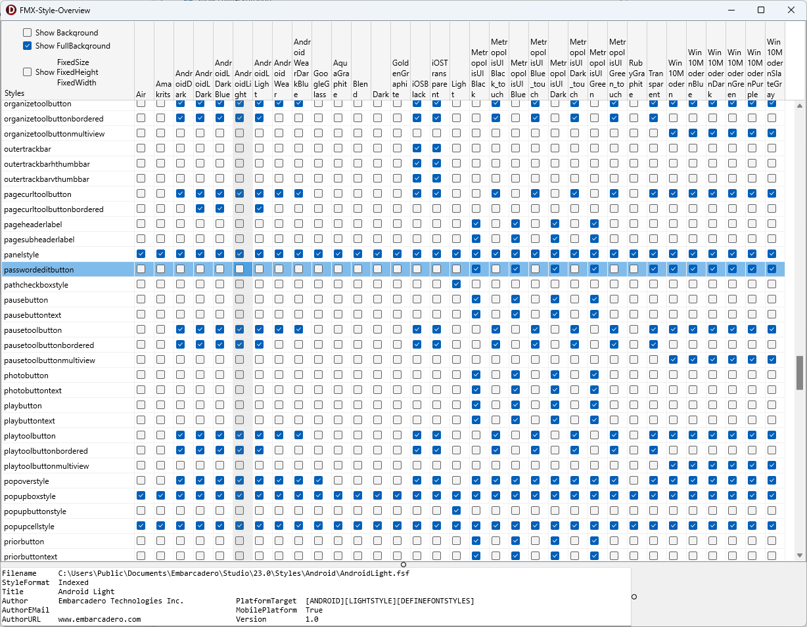
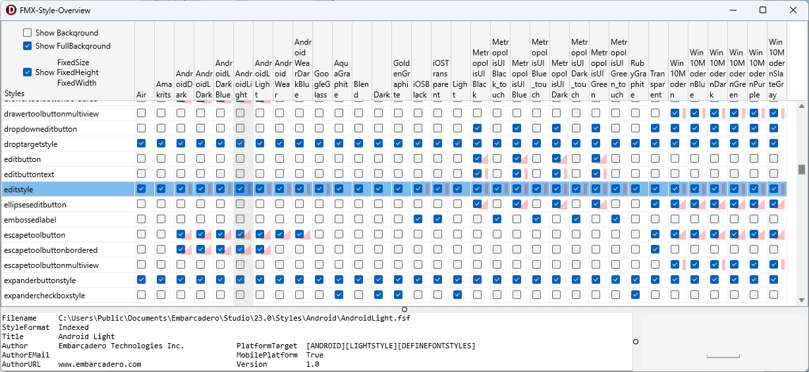

# pre-compiled Download

[FMXStyleOverview.exe](https://geheimniswelten.de/GitHub/FMXStyleOverview.exe) (11 MB)

# FMX-Style-Overview

Overview of all style resources in the Delphi FMX styles of a directory.  
*.style  = FMX-Style (text)  
*.fsf     = FMX-Style (binär)  
~~\*.vsf     = VCL-Style~~

* Some styles are missing and the component is then invisible.
  * e.g. TEdit->TPasswordEditButton in Android and iOS   
    [Delphi-PRAXiS: Question about TPasswordEditButton inside TEdit field](https://en.delphipraxis.net/topic/13252-question-about-tpasswordeditbutton-inside-tedit-field/)
* Other components have a fixed size/height, such as TButton and TEdit in Android.
  * Tip: This can be deactivated in the style (simply set FixedHeight and FixedWidth of the item to 0)

* at startup a VCL ~~File~~DirectoryOpenDialog opens
* select a directory with style files there
  * C:\Program Files (x86)\Embarcadero\Studio\23.0\Redist\styles\Fmx
  * C:\Users\Public\Documents\Embarcadero\Studio\23.0\Styles
* and then wait a bit
* ◢ = FixedSize  
   ▌ = FixedHeight  
   ▄ = FixedWidth
